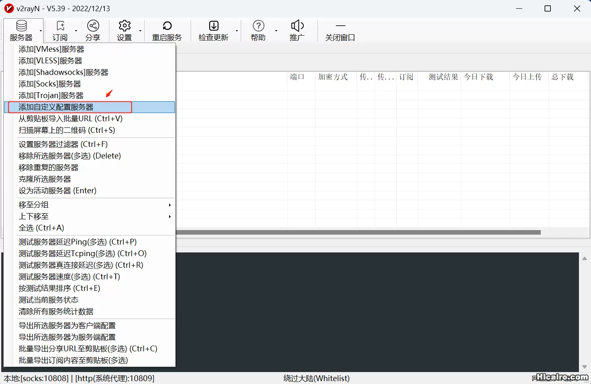
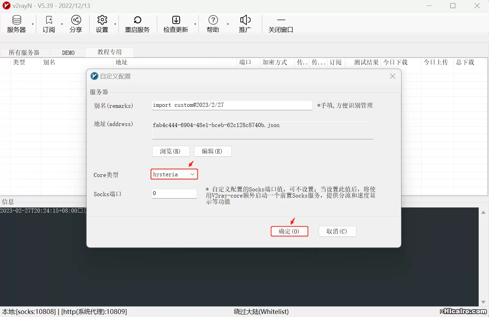
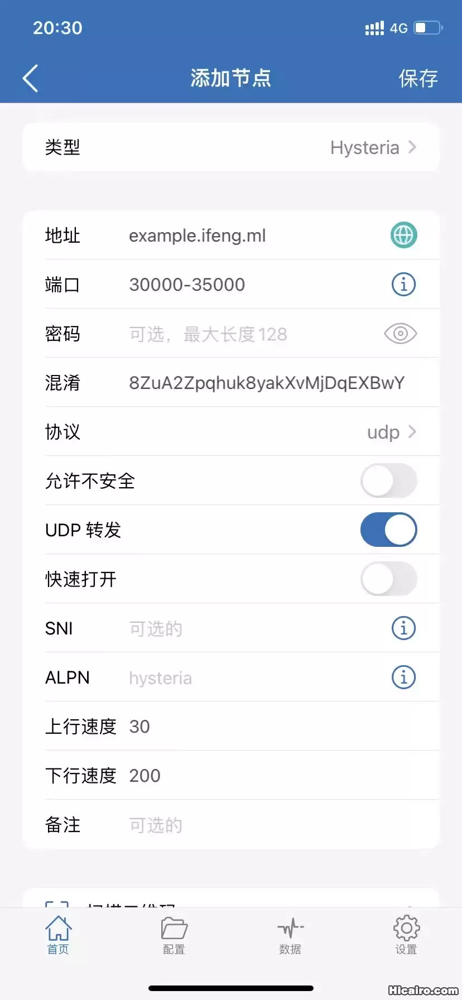

# 最新VPS搭建Hysteria翻墙梯子教程含一键安装脚本

Hysteria 是一个功能丰富的，专为恶劣网络环境进行优化的网络工具（双边加速），比如卫星网络、拥挤的公共 Wi-Fi、在中国连接国外服务器等。基于修改版的 QUIC 协议。由 go 编写的非常优秀的“轻量”代理程序，它很好的解决了在搭建科学上网服务器时的痛点——线路一般、高峰时期慢。虽然是走的 UDP 但是提供 obfs ，暂时不会被运营商针对性的 QoS ( 不开 obfs 也不会被 QoS )。

经过实际测试， Hysteria 协议在速度上碾压 vmess ， vless ，naive 等其他协议，值得推荐给大家。网上有关 Hysteria 的安装教程已经挺多了，也有一键安装脚本。尤其官方的一键安装脚本做的挺好，非常适合零基础的用户使用。但是总有一些技术控的小伙伴，想搞清楚一键安装脚本到底在自己的服务器上安装了什么软件，做了那些操作。或者通过一键安装脚本没有部署成功，自己也不知道什么原因。这篇教程将给大家简单还原一键脚本安装了那些软件，进行了那些配置。大家在了解这些信息后，如果出现没有部署成功时，也可以检查相关配置，排除故障。

**一、服务器安装环境**

本次教程的测试环境为：Vultr IPv4&IPv6双栈 VPS ，1vCPU ，1GB Memory ，25 GB SSD ， CentOS 7 Without SELinux 。

**二、服务器安装步骤**

1、对于 纯 IPv6 主机，打开 DNS64 ，其他主机跳过这一步。

Bash

```
echo -e "nameserver 2a01:4f8:c2c:123f::1" > /etc/resolv.conf
```

2、升级操作系统内核

建议升级一下系统内核，避免缺失某些依赖包而造成不必要的麻烦。

Bash

```
hostnamectl | grep -i system | cut -d: -f2
```

使用上述命令查询你的操作系统。

Bash

```
#Debian、Ubuntu等操作系统使用以下命令升级
apt update
apt upgrade -y
apt full-upgrade -y
apt-get install socat
#Redhat、Centos、Fedora等操作系统使用以下命令升级
yum -y update
rpm --import https://www.elrepo.org/RPM-GPG-KEY-elrepo.org
rpm -Uvh http://www.elrepo.org/elrepo-release-7.0-4.el7.elrepo.noarch.rpm
yum --enablerepo=elrepo-kernel install kernel-ml
grub2-set-default 0
yum -y remove kernel-3.*
yum install -y socat
```

3、配置防火墙

没有防火墙的服务器相当于裸奔，不管什么时候，建议打开操作系统的防火墙，然后在防火墙规则里放行自己使用的端口。

Bash

```
#查看防火墙状态
systemctl status firewalld
#设置开机启动防火墙
systemctl enable firewalld
#开启防火墙
systemctl start firewalld
```

为 Hysteria 服务在防火墙上放行相关端口。

Bash

```
# Hysteria 服务在申请域名证书时，需要使用 80/443 端口，我们在 IPv4&IPv6 规则表中放行 80&443 端口。
firewall-cmd --permanent --add-port=80/tcp
firewall-cmd --permanent --add-port=443/tcp
firewall-cmd --permanent --zone=public --add-rich-rule='
  rule family=ipv6
  source address=::/0
  port protocol=tcp port=80
  accept'
firewall-cmd --permanent --zone=public --add-rich-rule='
  rule family=ipv6
  source address=::/0
  port protocol=tcp port=443
  accept'
firewall-cmd --reload
#可以使用下面这行命名查询防火墙的规则表
firewall-cmd --list-all
```

为 Hysteria 服务放行监听端口及端口跳跃所使用的端口。以下示例中，我们准备使用 10255/udp 为监听端口，30000-35000/udp 为端口跳跃所使用的端口，你可以自行修改。

Bash

```
firewall-cmd --permanent --zone=public --add-port=10255/udp
firewall-cmd --permanent --zone=public --add-port=30000-35000/udp
firewall-cmd --permanent --zone=public --add-rich-rule='
  rule family=ipv6
  source address=::/0
  port protocol=udp port=10255
  accept'
firewall-cmd --permanent --zone=public --add-rich-rule='
  rule family=ipv6
  source address=::/0
  port protocol=udp port=30000-35000
  accept'
firewall-cmd --reload
```

为 Hysteria 服务设置端口转发，将 30000-35000/udp 端口收到的数据转发到端口 10255/udp 。

Bash

```
firewall-cmd --zone=public --add-forward-port=port=30000-35000:proto=udp:toport=10255 --permanent
firewall-cmd --zone=public --add-rich-rule='rule family=ipv6 forward-port port=30000-35000 protocol=udp to-port=10255' --permanent
firewall-cmd --reload
```

4、创建工作组和用户

Bash

```
#建议尽量不要使用 root 用户运行服务，我们创建一个名为 hysteria 的用户用于运行 hysteria 。 
groupadd --system hysteria
useradd --system \
    --gid hysteria \
    --create-home \
    --home-dir /var/lib/hysteria \
    --shell /usr/sbin/nologin \
    --comment "hysteria server" \
    hysteria
```

5、安装 Hysteria 服务端

Hysteria 项目在 GitHub 的项目地址为：https://github.com/apernet/hysteria 。

Bash

```
#下载最新版本的 hysteria
wget -q -O /usr/bin/hysteria https://github.com/apernet/hysteria/releases/download/v1.3.3/hysteria-linux-amd64
chmod a+x /usr/bin/hysteria
#创建 hysteria 配置文件目录
mkdir /etc/hysteria
```

6、安装域名证书

Hysteria 服务端 必须要 一个 TLS 证书。有两种方式,任选一种即可。

① 使用内置的 ACME 客户端从 Let’s Encrypt 自动获取一个证书。这是最简单的方式，前提是你有解析到服务器的域名和一个有效的邮箱地址。缺点是必须占用一个端口。使用这种方式时， **/etc/hysteria/config.json** 按照如下示例配置即可。

Bash

```
#示例中 example.ifeng.ml 已解析到服务器，obfs 为混淆密码
cat > /etc/hysteria/config.json <<EOF
{
  "listen": ":10255",
  "acme": {
    "domains": [
      "example.ifeng.ml"
    ],
    "email": "example@ifeng.ml"
  },
  "obfs": "8ZuA2Zpqhuk8yakXvMjDqEXBwY"
}
EOF
```

② 自定义证书 - 使用 acme.sh 手动申请证书

以下代码演示的是使用 acme.sh 手动申请证书，当然你也可以使用 dnspod 等第三方工具生成证书后，手动上传到对应位置。

Bash

```
curl https://get.acme.sh | sh
ln -s /root/.acme.sh/acme.sh /usr/local/bin/acme.sh
acme.sh --set-default-ca --server letsencrypt
#example.ifeng.ml 请替换为你的真实域名
#注意：hax.co.id/woiden.id 等纯 IPv6 主机，在下面命令中加上--listen-v6参数
acme.sh --issue -d example.ifeng.ml --keylength ec-256 --standalone --insecure
acme.sh --install-cert -d example.ifeng.ml --ecc \
        --key-file       /etc/hysteria/example.ifeng.ml.key  \
        --fullchain-file /etc/hysteria/example.ifeng.ml.pem
```

③ 自定义证书 - 自签证书

Bash

```
#生成私钥
openssl ecparam -genkey -name prime256v1 -out /etc/hysteria/example.ifeng.ml.key 
#生成证书
openssl req -new -x509 -days 36500 -key /etc/hysteria/example.ifeng.ml.key -out /etc/hysteria/example.ifeng.ml.pem  -subj "/CN=example.ifeng.ml"
```

使用自定义证书时， **/etc/hysteria/config.json** 按照如下示例配置即可。

Bash

```
cat > /etc/hysteria/config.json <<EOF
{
  "listen": ":10255",
  "cert": "/etc/hysteria/example.ifeng.ml.pem",
  "key": "/etc/hysteria/example.ifeng.ml.key",
  "obfs": "8ZuA2Zpqhuk8yakXvMjDqEXBwY"
}
EOF
```

7、将 Hysteria 作为守护进程运行

在 /etc/systemd/system/ 目录创建 hysteria.service

Bash

```
cat > /etc/systemd/system/hysteria.service <<EOF
[Unit]
Description=Hysteria Server Service (config.json)
After=network.target
[Service]
Type=simple
ExecStart=/usr/bin/hysteria -config /etc/hysteria/config.json server
WorkingDirectory=/etc/hysteria
User=hysteria
Group=hysteria
Environment=HYSTERIA_LOG_LEVEL=info
CapabilityBoundingSet=CAP_NET_ADMIN CAP_NET_BIND_SERVICE CAP_NET_RAW
AmbientCapabilities=CAP_NET_ADMIN CAP_NET_BIND_SERVICE CAP_NET_RAW
NoNewPrivileges=true
[Install]
WantedBy=multi-user.target
EOF
```

8、启动 Hysteria 服务端

Bash

```
chown -R hysteria:hysteria /etc/hysteria/
systemctl daemon-reload
systemctl enable hysteria
systemctl start hysteria
#查看当前状态
systemctl status hysteria
#使用更改的配置文件重新加载 hysteria
systemctl reload hysteria
```

**三、 客户端配置**

Hysteria 客户端：https://github.com/apernet/hysteria/releases/latest

1、根据客户端操作系统，下载对应的 Hysteria 客户端，以 64 位 windows 操作系统为例。

在官方网站下载 hysteria-windows-amd64.exe 文件并 copy 到 v2rayN 安装目录（v2rayN V5.39 copy 到安装目录，v2rayN V6.14 copy 到安装目录中的 \bin\hysteria ）。用记事本创建一个config.json文件，内容如下：

其中 up_mbps 和 down_mbps 分别指宽带签约的上行速率和下行速率，根据情况自行修改。

Bash

```
{
  "server": "example.ifeng.ml:30000-35000",
  "obfs": "8ZuA2Zpqhuk8yakXvMjDqEXBwY",
  "up_mbps": 30,
  "down_mbps": 200,
  "insecure": true,
  "socks5": {
    "listen": "127.0.0.1:10808"
  },
  "http": {
    "listen": "127.0.0.1:10809"
  }
}
```

2、v2rayN 客户端配置，点击菜单上“服务器”中的“添加自定义服务器”。



3、导入上一步配置好的 config.json 文件， Core 类型选择 hysteria 后点确定按钮。



4、苹果手机 Shadowrocket 客户端配置，类型选择 Hysteria ,分别填入地址、端口、混淆密码、上行速度、下行速度、协议选择 udp 后保存。



**四、 其他说明**

通过以上简单的配置，相信你已经搭建好了 Hysteria 代理，你也会发现 Hysteria 在速度上碾压其他协议。需要说明一下， Hysteria 不支持 CDN 反代，这点官方文档里已经说的很清楚了。

Hysteria 其他更多的功能，请参考官方文档（ [https://hysteria.network](https://hysteria.network/) ）自行配置。