## 2026最新VPS搭建SSR节点翻墙梯子教程含一键脚本

最新VPS搭建SSR翻墙梯子教程，只需要简单的三个步骤就可以自己动手搭建SSR，详细图文教程，SSR一键脚本安装，整个安装过程十分简单容易上手。

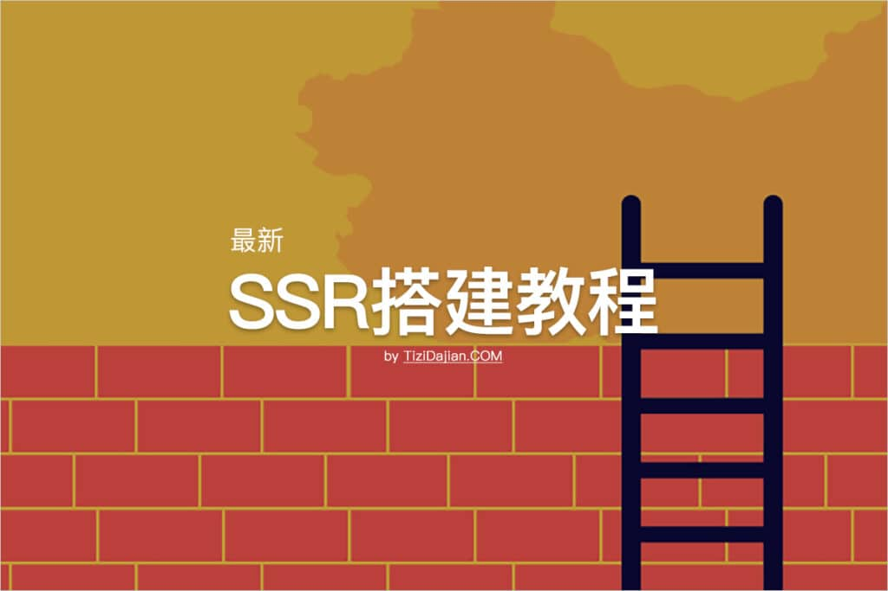最新SSR搭建教程

## SSR搭建详细图文教程

打开浏览器访问Google成功返回Google首页结果，就说明搭建SSR成功了，如何搭建呢？只需要简单的三个步骤就可以自己搭建SSR，下面就详细介绍SSR搭建步骤。

**Total Time:** 30 minutes

### 前期准备

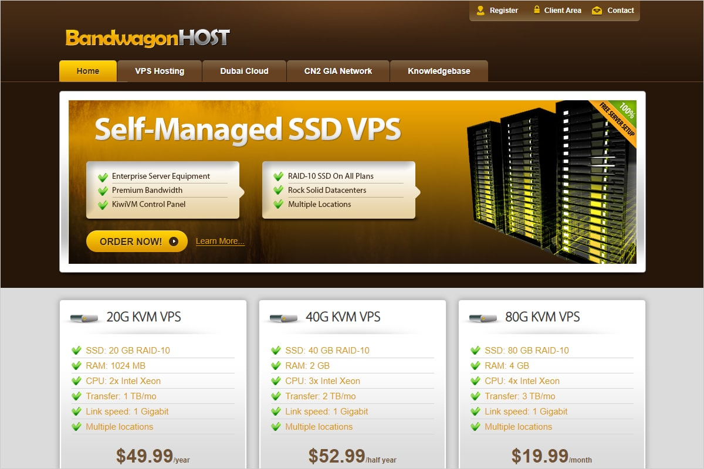

需要一台适合搭建SSR翻墙梯子的VPS服务器，VPS服务器操作系统推荐使用Linux操作系统，如Debian、CentOS、Ubuntu都可以。

### 第一步：创建SSR服务器


如果已经拥有VPS服务器的朋友可以跳过这一部分，没有服务器的朋友可以先创建SSR服务器，推荐使用搬瓦工VPS服务器，网络线路速度和稳定性一直以来都比较不错。
选择VPS服务器要从以下五个方面综合考虑去选择，分别是：
1、选择海外VPS服务商；
2、选择大牌VPS服务商；
3、是否支持更换IP地址；
4、是否可更换机房；
5、主机配置。
特别需要注意的是，在购买完成之后，需要验证服务器IP是否被封，可使用IP可用性工具来对购买的服务器进行测试，这一步至关重要。

### 第二步：连接SSR服务器

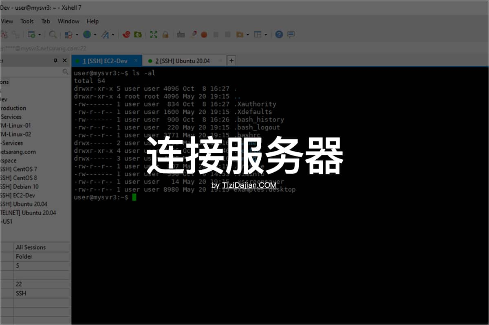

经过第一步创建好了服务器之后，现在就需要来连接SSR服务器，电脑端推荐使用Xshell来链接SSR服务器，可点击[Xshell官网](https://www.xshell.com/zh/free-for-home-school/)下载最新版，安装过程和普通的软件安装一样，很简单就不展开描述，在Xshell安装完成之后，就可以使用Xshell来连接SSR服务器，具体步骤如下：
1、打开XShell；
2、点击菜单栏【文件】，位于软件左上角；
3、点击【新建】；
4、名称随意，协议选择SSH，主机你的服务器IP（外网IP），端口默认22不变（映射端口和自设端口除外）；
5、点击确定；
6、在左侧会话管理器，选中刚添加的会话配置双击打开，可能会出现SSH安全警告，点击接受并保存即可；
7、提示输入用户名账号和密码，一般没特别设定用户名就是root，输入后记得点保存(没有提示可能IP被墙)；
8、进入服务器后，就可以运行一键安装SSR脚本代码了。

### 第三步：SSR搭建


在第二步成功连接SSR服务器之后，就可以使用SSR一键安装脚本进行SSR搭建了，整个过程都是完全自动的，只需要按照提示选择几个参数即可。

**Supply:**

- BandwagonHost
- Vultr
- Linode

**Tools:**

- Xshell
- JuiceSSH

### SSR一键脚本搭建教程

本文以CentOS为例进行演示。

#### 安装Wget

成功连接服务器后，首先运行以下命令安装 Wget 组件，Wget是一个在网络上进行下载的简单而强大的自由软件。

```
yum install -y wget
```

#### 执行SSR一键安装脚本

此一键搭建ShadowsocksR/SSR服务器脚本由 秋水逸冰(Teddysun) 制作，而且一直在更新，目前支持 CentOS 6+、Debian 7+、Ubuntu 12+ 及以上系统版本，内存要求：≥128M，不支持“WS+TLS+CDN”，也不需要绑定域名。

```
wget --no-check-certificate -O shadowsocks-all.sh https://raw.githubusercontent.com/teddysun/shadowsocks_install/master/shadowsocks-all.sh
chmod +x shadowsocks-all.sh
./shadowsocks-all.sh 2>&1 | tee shadowsocks-all.log
```

将以上命令粘贴到 Xshell 窗口，回车执行代码，然后会提示有以下4种安装选项，如下图所示。

ShadowsocksR 一键安装脚本

这里选第2个，搭建ShadowsocksR/SSR服务器。如下图所示。

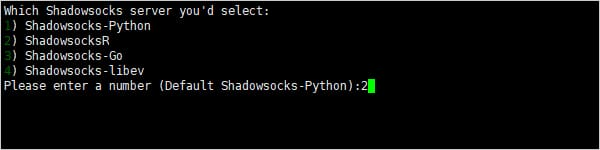ShadowsocksR

输入数字“2”后回车，然后进入ShadowsocksR服务器的参数配置选项，首先是服务器链接密码。如下图所示。

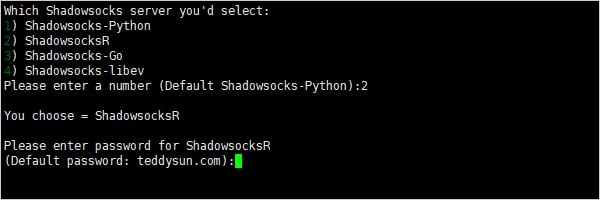配置 ShadowsocksR 服务器密码

接着选择 ShadowsocksR 服务器端口，如没有特别需求一般选择默认即可。如下图所示。

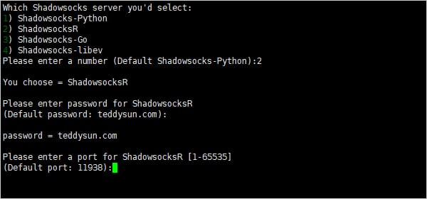配置 ShadowsocksR 服务器端口

接着选择加密方式即小火箭Shadowrocket当中的算法，建议选择 `chacha20` 相关的加密方式（因为这些新加密方式的抗封锁效果更好）。如下图所示。

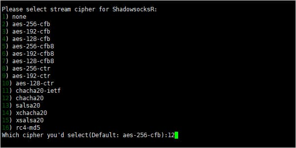配置 ShadowsocksR 服务器加密方式

接着选择 ShadowsocksR 的混淆协议，建议选择 `auth_aes_128_md5` 或者 `auth_aes_128_sha1` 这两种使用方面没有任何区别，这里我们选择 `auth_aes_125_md5` 作为 ShadowsocksR 的协议。如下图所示。

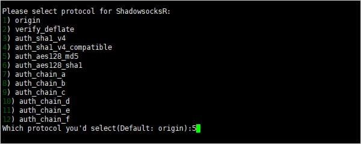配置 ShadowsocksR 服务器混淆协议

最后选择 ShadowsocksR 的混淆方式，建议选择 `tls1.2_ticket_auth_compatible` 这个混淆方式。如下图所示。

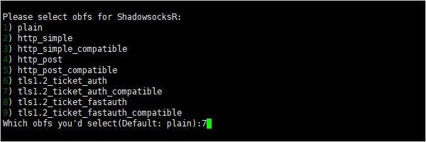配置 ShadowsocksR 服务器混淆方式

当以上参数选项都输入完毕后，敲击回车键。然后系统会提示“`Press any key to start…or Press Ctrl+C to cancel`“，即按任意键继续。如下图所示。

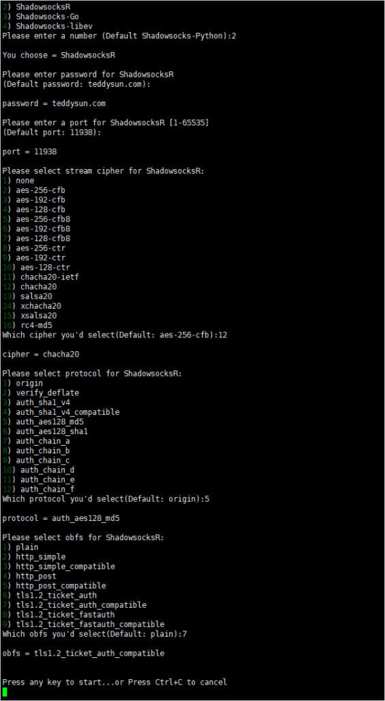ShadowsocksR 一键安装脚本开始安装

当我们按任意键之后，系统会进入安装ShadowsocksR服务的过程，稍等片刻即可完成。安装ShadowsocksR服务成功完成后，如下图所示。

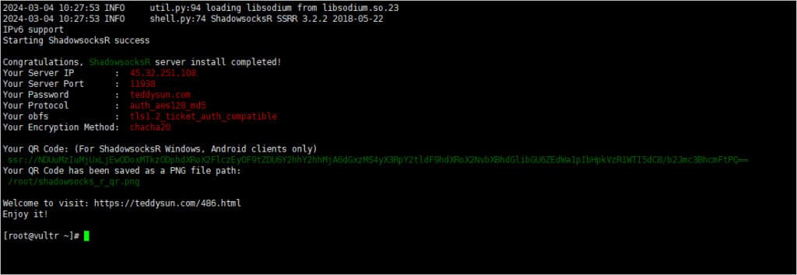ShadowsocksR 一键安装脚本安装完成

如上图所示，其中各项参数释义如下：

- Your Server IP: 你的服务器 IP 地址；
- Your Server Port: 你的服务器端口；
- Your Password: 你的连接密码；
- Your Protocol: 你的混淆协议；
- Your obfs: 你的混淆方式；
- Your Encryption Method: 你的加密方式；
- Your QR Code: 你的SSR链接；
- Your QR Code has been saved as a PNG file path: 你的SSR链接二维码图片的存放位置。

至此，你已经成功搭建ShadowsocksR/SSR服务器，现在就可以使用了。

## SSR客户端连接SSR

本文以iOS苹果系统平台下苹果手机的ShadowsocksR客户端Shadowrocket小火箭举例来连接ShadowsocksR服务器，其它平台客户端的连接方式基本都大同小异。

首先[下载Shadowrocket](https://free-nodes.github.io/shadowrocket/shadowrocket_download.html)小火箭，需要美区苹果ID才可以下载购买，如果没有美区ID的话可参考：[美区 Apple ID 账号申请注册教程免费购买](https://clashgithub.com/usa-apple-id.html)。

### 手动添加SSR服务器

点击软件主界面左上角 ➕ 按钮，在弹出窗口进入添加节点界面，类型选择 `ShadowsocksR` 后，出现 ShadowsocksR 配置界面。如下图所示。

[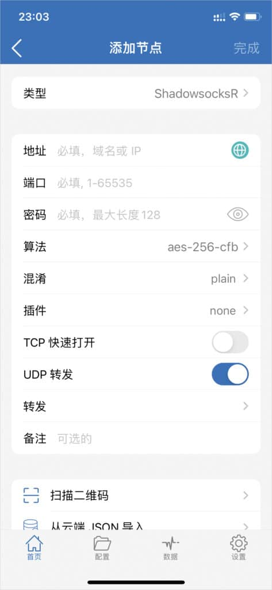](https://www.tizidajian.com/wp-content/uploads/2023/05/1709633434-Shadowrocket-Add-Server-ShadowsocksR.jpg)Shadowrocket 配置 Shadowsocks 服务器节点信息

填写完成SSR服务器相关参数之后就可以正常使用了，更详细教程可参考[Shadowrocket 使用教程快速入门篇](https://free-nodes.github.io/shadowrocket/shadowrocket_tutorial.html)。

