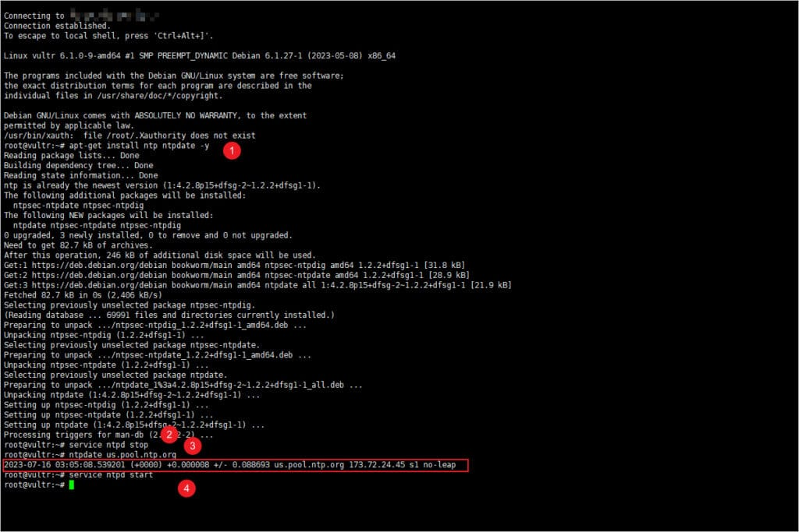
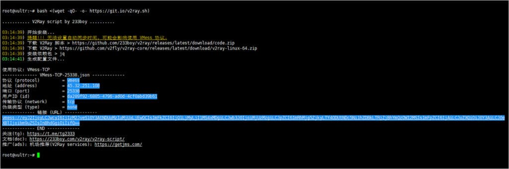
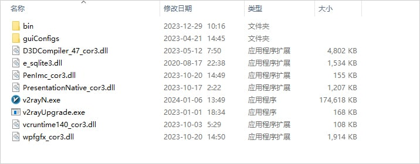
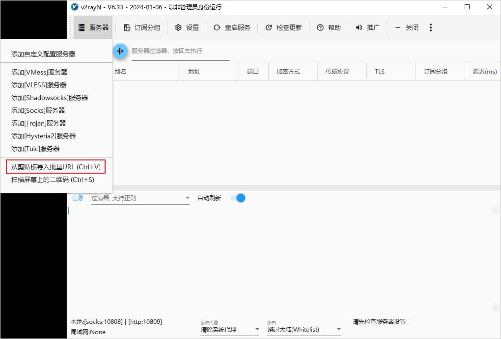
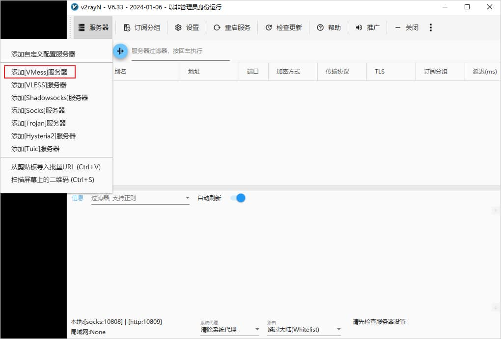
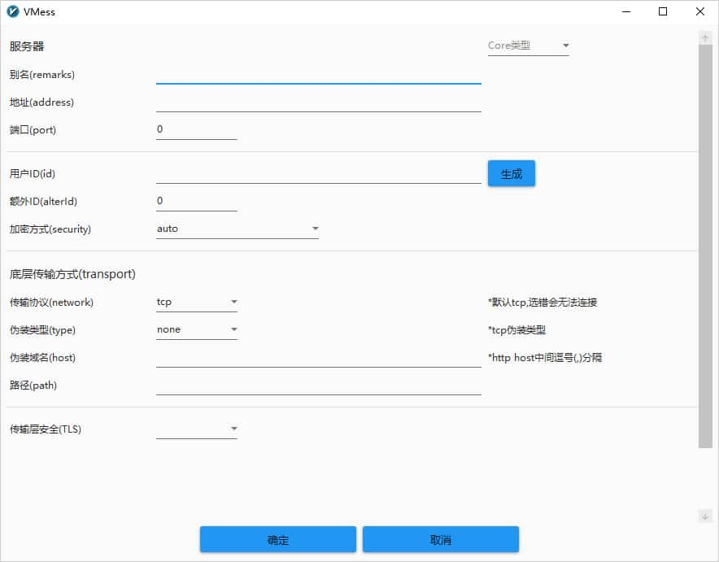

## 2026最新VPS搭建V2Ray翻墙梯子教程含一键脚本

最新VPS搭建V2Ray翻墙梯子教程，只需要简单的三个步骤就可以自己动手搭建V2Ray，详细图文教程，一键搞定所有V2Ray配置，V2Ray一键脚本安装，整个安装过程十分简单容易上手。

最新V2Ray搭建教程


## V2Ray搭建详细图文教程

打开浏览器访问Google成功返回Google首页结果，就说明搭建V2Ray成功了，如何搭建呢？只需要简单的三个步骤就可以自己搭建V2Ray，下面就详细介绍V2Ray搭建步骤。

**Total Time:** 30 minutes

### 前期准备


需要一台适合搭建V2Ray翻墙梯子的VPS服务器，VPS服务器操作系统推荐使用Linux操作系统，如Debian、CentOS、Ubuntu都可以。

### 第一步：创建V2Ray服务器


如果已经拥有VPS服务器的朋友可以跳过这一部分，没有服务器的朋友可以先创建V2Ray服务器，推荐使用搬瓦工VPS服务器，网络线路速度和稳定性一直以来都比较不错。
选择VPS服务器要从以下五个方面综合考虑去选择，分别是：
1、选择海外VPS服务商；
2、选择大牌VPS服务商；
3、是否支持更换IP地址；
4、是否可更换机房；
5、主机配置。
特别需要注意的是，在购买完成之后，需要验证服务器IP是否被封，可使用IP可用性工具来对购买的服务器进行测试，这一步至关重要。

### 第二步：连接V2Ray服务器


经过第一步创建好了服务器之后，现在就需要来连接V2Ray服务器，电脑端推荐使用Xshell来链接V2Ray服务器，可点击[Xshell官网](https://www.xshell.com/zh/free-for-home-school/)下载最新版，安装过程和普通的软件安装一样，很简单就不展开描述，在Xshell安装完成之后，就可以使用Xshell来连接V2Ray服务器，具体步骤如下：
1、打开XShell；
2、点击菜单栏【文件】，位于软件左上角；
3、点击【新建】；
4、名称随意，协议选择SSH，主机你的服务器IP（外网IP），端口默认22不变（映射端口和自设端口除外）；
5、点击确定；
6、在左侧会话管理器，选中刚添加的会话配置双击打开，可能会出现SSH安全警告，点击接受并保存即可；
7、提示输入用户名账号和密码，一般没特别设定用户名就是root，输入后记得点保存(没有提示可能IP被墙)；
8、进入服务器后，就可以运行一键安装V2Ray脚本代码了。

### 第三步：V2Ray搭建


在第二步成功连接V2Ray服务器之后，就可以使用V2Ray一键安装脚本进行V2Ray搭建了，整个过程都是完全自动的，只需要按照提示选择几个参数即可。

**Supply:**

- BandwagonHost
- Vultr
- Linode

**Tools:**

- Xshell
- JuiceSSH

### V2Ray一键脚本搭建教程

由于V2Ray对时间要求比较严格，要求误差必须在90秒以内，否则会导致安装失败。另外，时间误差跟服务器系统的时区没有直接关系，任意时区都可以，你也可以把服务器设置为跟你本地计算机处于同一时区，可以使用时间同步组件来实现时间同步。

#### 安装时间同步组件ntp

VPS服务器需要进行服务器时间同步校对时就需要用到时间同步组件ntp，使服务器时间保持跟全球网络同步。

##### Debian/Ubuntu

```
apt-get install ntp ntpdate -y
```

##### CentOS/RedHat

```
yum install ntp ntpdate -y
```

安装完成后，先停止当前 VPS 服务器的 NTP 服务

```
service ntpd stop
```

然后再使当前 VPS 服务器的时间与时间服务器进行同步

```
ntpdate us.pool.ntp.org
```

最后启动 NTP 服务

```
service ntpd start
```

至此V2Ray服务器时间同步就完成了，如何验证服务器时间组件NTP是否同步？

[](https://www.tizidajian.com/wp-content/uploads/2023/05/1689477196-V2Ray-NTP.jpg)使用NTP同步V2Ray服务器时间

如上图所示，执行完上面的步骤后就可以看到服务器的时间及所在的时区。

至此V2Ray服务器配置完成，接下来就可以一键搭建V2Ray了。

#### 执行V2Ray一键安装脚本

新的一键V2Ray脚本，安装简单方便，自动安装BBR加速，自动进行V2Ray相关配置，因此十分推荐使用，在Xshell命令界面输入以下命令回车执行即可。

```
bash <(wget -qO- -o- https://git.io/v2ray.sh)
```

当执行了上面的安装命令，整个安装过程大概几分钟就可以完成，并且没有错误提示的话，那么你就能看到类似下面的图片，就代表安装成功。

[](https://www.tizidajian.com/wp-content/uploads/2023/05/1689477529-V2Ray-Script.jpg)V2Ray一键脚本安装

记录上图当中的V2Ray配置信息，即上图中蓝色部分，在客户端手动添加V2Ray服务器的时候会用到，上图中链接可以在支持订阅链接的客户端直接一键导入使用。

截止这里使用VPS搭建V2Ray就成功了，接下来就需要使用V2Ray客户端来连接V2Ray。

## V2Ray客户端连接V2Ray

本文以Windows平台下的V2Ray客户端v2rayN举例来连接V2Ray服务器，其它平台客户端的连接方式基本都大同小异。

首先[下载v2RayN](https://free-nodes.github.io/v2rayn/v2rayn_download.html)，下载完成之后解压即可使用，解压后的目录如下图所示，不同版本的文件数量可能会有不同，这个不必纠结，只要能正常链接V2Ray服务器即可。

[](https://www.tizidajian.com/wp-content/uploads/2023/05/1709514705-v2rayN-Floder.jpg)v2rayN 安装文件目录

单击鼠标右键以管理员身份运行 `v2rayN.exe` 即可开始使用，程序启动后会最小化到任务右小角的托盘，鼠标双击蓝色的 `V` 字小图标，即可打开软件的主界面。

### 从剪贴板导入方式添加V2Ray服务器

首先复制V2ray服务器的节点地址，即以 `vmess://` 开头的链接。

然后点击软件主界面的`服务器`，选择**从剪贴板导入批量URL**即可导入节点信息，如下图所示。

[](https://www.tizidajian.com/wp-content/uploads/2023/05/1709515139-v2rayN-add-Server-from-Clipboard.jpg)v2rayN 从剪贴板导入批量URL

### 手动添加V2Ray服务器

点击软件主界面的`服务器`，选择 `添加[VMess]服务器`，如下图所示。

[](https://www.tizidajian.com/wp-content/uploads/2023/05/1709515401-v2rayN-add-Server-VMess-Server.jpg)v2rayN 添加 V2Ray 服务器节点

在添加窗口输入V2Ray服务器节点信息，即可配置V2Ray服务器信息，然后点击确定保存，如下图所示。

[](https://www.tizidajian.com/wp-content/uploads/2023/05/1709515342-v2rayN-add-Server-VMess-Server-Config.jpg)v2rayN 配置 V2Ray 服务器节点信息

至此使用V2Ray客户端连接V2Ray就完成了，更详细教程可参考[v2rayN使用教程快速入门篇](https://github.com/clashbk/clash/wiki/v2rayn)。